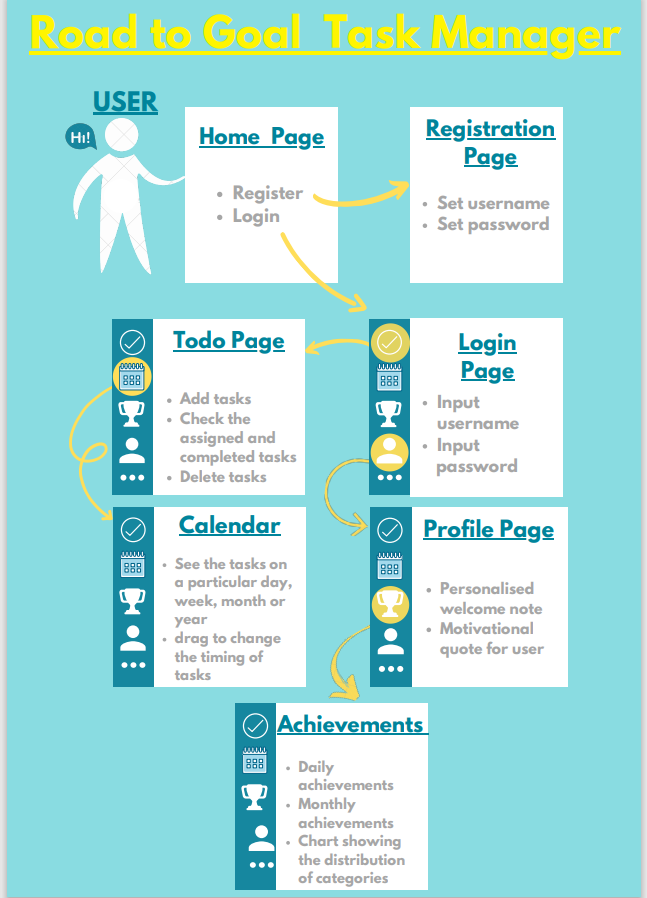

# RoadToGoal---Task-tracker-application
"Road To Goal" is a user-friendly task management website created with a motive to help and encourage users to manage their tasks and complete it within the specified time. Firstly, the users should sign-up by creating an account by providing a username and password, this is a one-time process.Later just a login is needed to be done. The first page that appears after login is the home page. Each time a user signs in, they see
different motivational quotes. In the to-do page, one can add tasks, check it once completed and remove it
from the list. All the changes will be reflected in the database as well as in the calendar. The events
mentioned will be seen in the calendar and users can adjust the timings of the day just by scrolling over
the mentioned day. The achievement page contains real time graphs which helps the user to check out
their daily and weekly progress.
<a href="https://drive.google.com/file/d/1C5OPr9kSej_2g2utUuyh5-eHrQZeL8R1/view">Project Report</a>

  

